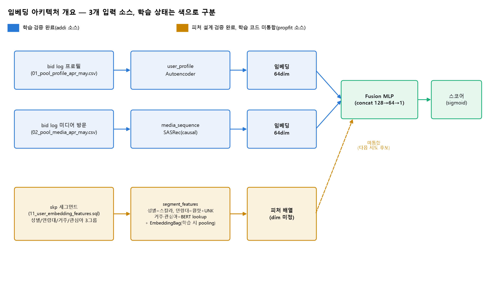
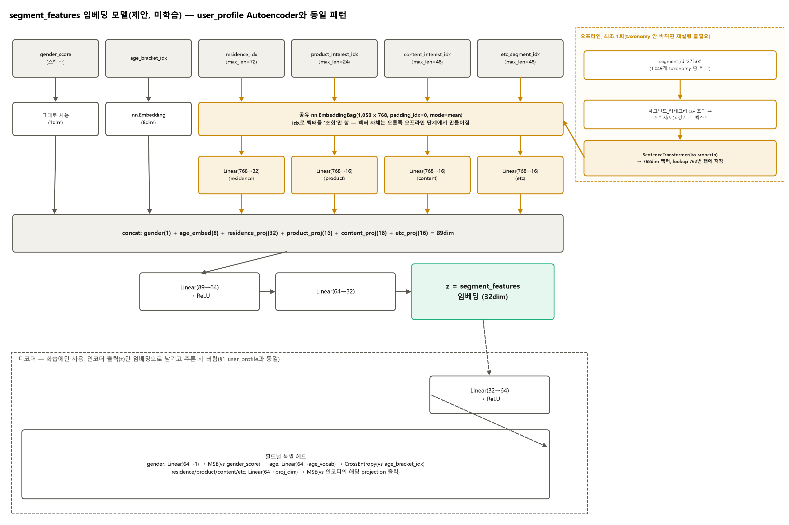

# 모델 아키텍처 스펙

`embedding/`(모델 정의) 기준 요약. 필드/하이퍼파라미터를 바꾸면 이 문서도 같이 갱신한다.
실행 방법은 [`README.md`](../README.md) 참고, 이 문서는 "무엇을 어떻게 인코딩하는가"만 다룬다.

입력 소스가 2개(addi bid log, §1~3 — 학습·백테스트까지 완료)와 1개(propfit skp 세그먼트,
§4 — 피처 설계·검증만 완료, 학습 코드 미통합)로 나뉜다. 색으로 학습 상태를 구분한 전체 그림:



## 1. `user_profile` — Autoencoder (`embedding/user_profile/`)

입력: `data/raw/01_pool_profile_apr_may.csv`(유저 1행 스냅샷). 레이블 없이 "자기 자신을 복원"하는
reconstruction loss로 학습. 인코더 출력(64차원)이 임베딩, 디코더는 학습에만 쓰고 버림.

```
[범주형] → 필드별 nn.Embedding ─┐
                                  ├─ concat → Linear(128) → ReLU → Linear(64) = z (임베딩)
[수치형] → log1p(선택)+표준화 ─┘
z → Linear(128) → ReLU → 필드별 Linear(복원) → cross-entropy(범주형) / masked MSE(수치형)
```

| 필드 | 종류 | 임베딩 차원 | 비고 |
|---|---|---|---|
| `device_os_version` | 범주형 | 8 | 메이저 버전만 사용("14.2.1"→"14") |
| `region` | 범주형 | 16 | ISO-3166-2, min_freq=5 |
| `app_bundle` | 범주형 | 4 | 통신사 IPTV 앱 3종(SKB/KT/LGU+). 유저별로 기간 내내 고정값(멀티 유저 0명 확인) |

미사용(화이트리스트에 없음): `req_user_id`, `device_ifa`, `update_dt`.
하이퍼파라미터: hidden=128, embed_dim=64, batch=256, epoch=30, lr=1e-3(Adam).

**컬럼 축소(2026-07-08)**: 원래 `device_os`/`device_type`/`device_lmt`/`country`/`language`/
`carrier`/`device_make`/`device_model`/`device_w`/`device_h`/`device_pxratio`까지 11개
필드를 더 실었는데, addi CTV 인벤토리 실측 결과 전부 상수이거나 거의 전부 NULL이었다
(`device_os`=100% "android", `device_type`=100% "3", `device_make`=100% "Android",
`device_model`=100% "generic", `carrier`=99.99% NULL, `device_lmt`=100% NULL,
`device_pxratio`=100% NULL, `device_w`/`device_h`=상수 1920/1080, `country`=100% "KOR",
`language`=99.998% "ko"). 학습 피처로서 정보량이 없어 전부 빼고, `carrier`가 늘 NULL이라
못 쓰는 통신사 식별 신호를 `app_bundle`로 대체했다. `NUMERIC_FIELDS`는 현재 빈 딕셔너리.

## 2. `media_sequence` — SASRec (`embedding/media_sequence/`)

입력: `data/raw/02_pool_media_apr_may.csv`(이벤트 그레인: 유저×미디어×시각, 같은 유저가
같은 값을 30분 이내 재방문한 이벤트는 SQL에서 이미 제거됨). "다음에 뭘 볼지" 예측하는
causal next-item 학습(레이블 불필요). 마지막 실제 위치의 hidden state = 유저 임베딩(64차원).

**`media` = `content_genre`의 대표(콤마로 구분된 첫) 토큰이지 `app_bundle`이 아니다.**
addi는 CTV 인벤토리라 app_bundle이 통신사 IPTV 앱 3종뿐이라 vocab이 사실상 상수 —
다음-아이템 예측이 무의미해져서(loss가 처음부터 0에서 안 움직임) genre 기반으로 바꿨다.
바뀐 뒤 vocab 115종, loss가 정상적으로 감소함(3.70→2.37, 5 epoch 기준).

```
media(장르 대표값), content_genre(전체 장르, 보조), ad_type(보조), connection_type(보조, addi는 컬럼 없어 항상 NULL)
  → item_embedding + genre_embedding(EmbeddingBag, mean) + ad_type_embedding + connection_type_embedding + position_embedding (전부 합산)
  → TransformerEncoder(causal mask, 2 layer, 2 head)
  → 마지막 실제 위치 hidden state = 임베딩(64차원)
```

| 하이퍼파라미터 | 값 |
|---|---|
| `MAX_SEQ_LEN` | 50 (유저당 최근 50 스텝) |
| `EMBED_DIM` | 64 |
| `N_HEADS` / `N_LAYERS` / `FFN_DIM` | 2 / 2 / 128 |
| `MAX_VOCAB_SIZE`(media) | 500 (addi는 실제 115종만 사용) |
| `BATCH_SIZE` / `NUM_EPOCHS` / `LR` | 128 / 30(기본, 파일럿은 5) / 1e-3 |

시퀀스 길이 2 미만인 유저는 학습에서 제외되지만(다음 아이템을 만들 수 없어서), 추론
(`inference/media_sequence.py`)에서는 전부 포함해서 임베딩을 뽑는다.

## 3. Fusion + 스코어링 (`scoring/`, 지도학습 fusion 분류기)

두 임베딩(각 64차원)을 `req_user_id`로 concat → 128차원(`scoring/fused_embeddings.py`). 그
위에 얕은 MLP를 얹어 "시드(postback 유저 중 실제 몰 IP 매칭 전환)=1 / 비시드=0" 라벨로 직접
지도학습한다. 분류기 학습(`scoring/train_supervised_lookalike.py`)과 저장된 분류기로
스코어링 대상을 채점하는 스크립트(`scoring/infer_supervised_lookalike.py`)가 분리돼 있다 —
`scoring/fusion_classifier.py`(모델 정의 + 아티팩트 저장/로드)를 공유한다. 실행 커맨드는
[`README.md`](../README.md) §2-4 참고.

```
Linear(128→64) → ReLU → Dropout(0.2) → Linear(64→1) → sigmoid = 스코어
```

`BCEWithLogitsLoss`(클래스 불균형 보정 `pos_weight`), Adam lr=1e-3, batch=512, 20 epoch.
임베딩 자체는 재학습하지 않고 고정, 이 얕은 분류기만 학습. 시드(양성) 비율이 극단적으로
낮아서(0.01~0.17% 수준) 층화 미니배치 샘플링(`--pos-frac`)·라벨 층화 train/val 분할·PR-AUC
및 recall@top-K% 리포트를 추가했다 — 자세한 배경은
[`docs/_archive/202607091610.md`](_archive/202607091610.md) 참고.

**성능(2026-07-09 재학습, 6월 postback 유저 269,914명 백테스트)**: 층화 pool(음성 5% 샘플 +
양성 전수 388명, 총 425,043명) 기준 val_auc **0.79~0.82**, held-out(6월 IP 매칭 전환 라벨)
최상위 10% 누적 lift **1.60x**(decile 순서도 대체로 단조적). 자세한 수치/해석은
[`docs/_archive/202607091610.md`](_archive/202607091610.md) 참고. (시드 centroid 코사인
유사도 baseline은 최하위 10%만 구분하고 나머지는 순위를 못 매겨 폐기 — 히스토리는
`docs/_archive/` 참고.)

## 4. `segment_features` — propfit skp 세그먼트 피처(`embedding/segment_features/`, 설계 완료·학습 미통합)

입력: [`querys/propfit/11_user_embedding_features.sql`](../querys/propfit/11_user_embedding_features.sql)
(device_ifa 단위, skp `segments` 컬럼을 성별/연령대/거주/제품 관심사/콘텐츠 관심사/기타
6개 그룹으로 나눠 뽑음 — 그룹 정의·커버리지 실측 근거는
[`querys/propfit/README.md`](../querys/propfit/README.md) 참고). §1~3과 달리 아직 이 피처를
소비하는 학습 루프(`model.py`/`dataset.py`)가 없다 — 여기 있는 건 "피처를 어떻게 인코딩할
것인가"까지 확정하고 검증한 것.


필드별 인코딩 방식이 서로 다르다(2026-07-24 대화에서 확정):

| 필드 | 방식 | 비고 |
|---|---|---|
| `gender_score` | 스칼라(-1.0~+1.0), SQL에서 이미 계산 | 여성(High)=+1.0/여성(Low)=+0.5/남성(High)=-1.0/남성(Low)=-0.5, 매칭 여러 개면 평균(예: High+Low 동시면 ±0.75). High/Low가 "확신도"라는 의미를 원핫이 아닌 스칼라로 보존 |
| `age_bracket_idx` | `CategoryVocab` 원핫(0=`<NA>`, 1=`<UNK>`=모름, 2~=실제 값) | `avg_matched≈1.04`라 거의 항상 단일값, 드물게 여러 개면 첫 값만 사용 |
| `residence_idx` | segment_id 인덱스 배열(`max_len=72`), 학습 시 EmbeddingBag pooling | 거주지(도)/서울거주지(구)/목적지(도·구·업종) 5개 depth2를 쪼개지 않고 하나의 bag으로(2026-07-24 결정) |
| `product_interest_idx` / `content_interest_idx` / `etc_segment_idx` | 각각 segment_id 인덱스 배열(`max_len=24/48/48`), 학습 시 EmbeddingBag pooling | 같은 BERT lookup을 공유하되 그룹별로 분리 풀링 — 인구 겹침(08 쿼리, 기타가 제품·콘텐츠를 98%+ 포함)이 정보 겹침을 뜻하진 않아 하나로 합치지 않음 |

거주·관심아 4그룹은 `segment_bert_lookup.npz`(세그먼트_카테고리.csv의 depth1/2/3+이름 경로
텍스트를 `jhgan/ko-sroberta-multitask`로 인코딩, 1,049 x 768)를 공유 lookup으로 쓴다. index
0은 padding 전용(전부 0벡터, `embedding/media_sequence`의 `genre_embedding`과 동일한
`nn.EmbeddingBag(padding_idx=0)` 컨벤션) — 실제 mean pooling은 이 lookup을 초기 가중치로 쓰는
EmbeddingBag이 학습 시 배치 단위로 계산하고, `build_features.py`는 인덱스 배열까지만
만들어서 저장한다.

**저장 방식을 이렇게 정한 이유(디바이스별 dense 벡터 사전 계산은 규모가 안 됨)**: 처음엔
그룹별로 미리 mean pooling한 768dim 벡터를 디바이스마다 저장하려 했는데, 1% 표본(53만
건)만으로 6.27GB가 나왔다 — 전체 모집단(5,330만 명, ~100배)으로 확장하면 약 627GB로 저장이
불가능하다. 인덱스 배열만 저장하는 방식으로 바꾸니 같은 표본이 806.5MB(7.8배 감소, 전체
환산 시 약 78GB)로 줄었다.

| 하이퍼파라미터 | 값 |
|---|---|
| BERT 모델 | `jhgan/ko-sroberta-multitask` (768dim, 사전학습 한국어 SBERT) |
| lookup 크기 | 1,049개 segment_id(+padding 1행) |
| `max_len`(residence / product / content / etc) | 72 / 24 / 48 / 48 (1% 표본 p99 기준, 초과분은 뒤에서부터 자름) |

### 4-1. 임베딩 모델(제안, 미학습)

여기서부터는 아직 코드로 옮기지 않은 설계안이다 — §1 `user_profile`과 같은 이유(시퀀스가
아니라 유저 1명당 스냅샷 필드들이라 SASRec 같은 순서 기반 구조가 안 맞음)로 **Autoencoder**
구조를 그대로 따르는 게 자연스럽다: 레이블 없이 "자기 자신을 복원"하며 인코더 출력을
임베딩으로 쓰고 디코더는 학습에만 쓰고 버린다.



- `age_bracket_idx`는 `nn.Embedding(vocab, 8)`로(§1 `device_os_version`과 같은 8dim),
  `residence_idx`/`product_interest_idx`/`content_interest_idx`/`etc_segment_idx`는 **하나의
  공유 `nn.EmbeddingBag`**(가중치는 `segment_bert_lookup.npz`로 초기화, `freeze=False`로 두면
  파인튜닝도 가능)에 4번 호출해 각각 768dim으로 풀링한다.
- 768dim은 나머지 필드(1~8dim)에 비해 압도적으로 커서, 그대로 concat하면 사실상 거주/관심아
  4개 벡터가 임베딩 전체를 지배한다 — 그래서 그룹별로 작은 `Linear` 투영(residence→32,
  product/content/etc→16)을 거친 뒤에 concat한다. 투영 차원은 §1의 `region`(16)>`app_bundle`
  (4)처럼 "그룹이 담는 정보량"에 대략 비례하게 잡았다(거주가 카디널리티도 max_len도 가장
  커서 32로 더 크게).
- concat(89dim) → `Linear(89→64)→ReLU→Linear(64→32)` = z(임베딩). z 차원(32)은 §1/§2의
  64dim보다 작게 뒀다 — 원본 신호 자체가 6개 필드로 상대적으로 단순해 굳이 64dim까지 안 써도
  된다고 봤지만, 확정 값은 아니고 실험 후 조정 대상.
- 디코더는 필드별 복원 헤드로 갈라진다: `gender_score`는 MSE, `age_bracket_idx`는
  cross-entropy, 거주/관심아 4그룹은 (원본 768dim이 아니라) **인코더가 만든 투영 벡터를
  재구성**하는 MSE로 뒀다 — 768dim 자체를 복원 타깃으로 쓰면 손실이 그 큰 차원에 지배돼
  다른 필드 신호가 묻힐 수 있어서다. 대안으로 그룹별 원래 vocab에 대한 multi-hot(있음/없음)
  예측(BCE)도 검토할 만하다(AutoRec류 implicit-feedback 오토인코더 방식) — 어느 쪽이
  나은지는 실험 필요.

## 5. 아직 없는 것 / 다음 시도 후보

- `media_sequence`를 파일럿 축소(10만 유저/5epoch)가 아니라 전체 규모(59만+/30epoch)로 재학습
- 조기 종료/베스트 에폭 체크포인트 저장 — `val_recall@top10%`가 epoch마다 크게 흔들려서
  마지막 epoch가 최선이라는 보장이 없음(검증셋 양성이 수십 명 수준)
- centroid 대신/추가로 k-NN 스코어링
- `media_sequence` 단독 스코어링으로 `user_profile`이 신호를 얼마나 흐리는지 분리 검증
- 광고주(`addi_business`) 정보를 활용한 two-tower — **현재 데이터로는 불가능**(README 알려진
  이슈 참고, `cmp_no`↔`adspid` 매핑 없음)
- `segment_features`를 실제로 소비하는 `model.py`/`dataset.py` 작성 + `user_profile`/
  `media_sequence`와의 fusion 방식 결정(단순 concat 3-way vs 별도 게이팅) — §4 참고
