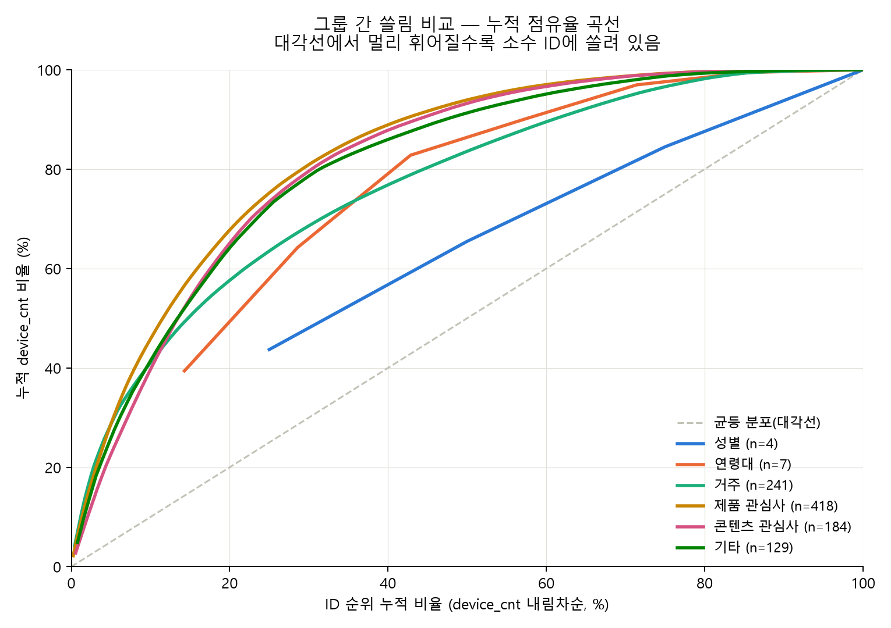
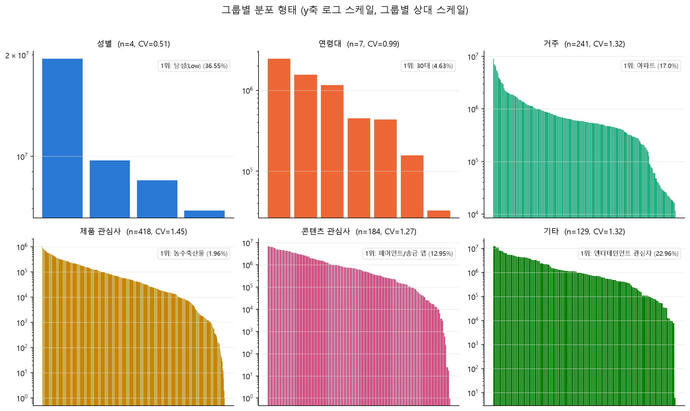

# 세그먼트 그룹별 분포 분석

날짜: 2026-07-24. 관련 코드: [`eda/queries/segment_coverage/08_group_value_distribution.sql`](../queries/segment_coverage/08_group_value_distribution.sql)
(구 `querys/propfit/10_group_value_distribution.sql`),
생성 스크립트: [`../assets/_gen_segment_report.py`](../assets/_gen_segment_report.py).

## 배경

`skp.segments`를 6개 그룹(성별·연령대·거주·제품 관심사·콘텐츠 관심사·기타)으로 묶은 뒤,
그룹 내부 개별 세그먼트 값이 `device_cnt` 기준으로 얼마나 고르게 혹은 쏠려서 분포하는지
점검한다 — EmbeddingBag 어휘(vocab) 설계에 바로 쓰일 근거 자료. 원본 데이터는
[`../assets/세그먼트id별분포.csv`](../assets/세그먼트id별분포.csv)(983행,
10_group_value_distribution.sql 실행 결과)이고, 모집단은 skp에 세그먼트가 하나라도 있는
device_ifa 전체(~53,341,243명, bid log 전체 모집단의 21.8%)다.

## 1. 그룹별 분포 통계

전체 데이터는 [`../assets/segment_group_summary_stats.csv`](../assets/segment_group_summary_stats.csv) 참고.

| 그룹 | ID 수 | 평균 | 중앙값 | 표준편차 | CV | 최소 | 최대 | 1위 값 |
|---|---:|---:|---:|---:|---:|---:|---:|---|
| 성별 | 4 | 11,154,276 | 9,104,579 | 5,677,550 | 0.51 | 6,913,394 | 19,494,554 | 남성(Low) 36.55% |
| 연령대 | 7 | 895,586 | 451,312 | 883,697 | 0.99 | 32,753 | 2,469,668 | 30대 4.63% |
| 거주 | 241 | 904,660 | 580,186 | 1,196,878 | 1.32 | 11,787 | 9,068,128 | 아파트 17.00% |
| 제품 관심사 | 418\* | 113,983 | 45,178 | 165,095 | 1.45 | 1 | 1,044,695 | 농수축산물 1.96% |
| 콘텐츠 관심사 | 184 | 1,360,101 | 619,869 | 1,729,912 | 1.27 | 1 | 6,907,456 | 페이먼트/송금 앱 12.95% |
| 기타 | 129 | 1,952,382 | 873,786 | 2,570,658 | 1.32 | 6 | 12,248,307 | 엔터테인먼트 관심자 22.96% |

\* taxonomy상 420개 ID 중 418개만 관측됨 — 2개는 이번 모집단에서 매칭 0건이라 결과에
아예 나타나지 않음(GROUP BY 특성상 관측 0건인 값은 행 자체가 생기지 않음).

**주의: 위 raw CV는 그룹끼리 직접 비교하면 안 된다.** §4에서 이유와 올바른 비교 방법을 다룬다.

## 2. 그룹 간 쏠림 비교 — 누적 점유율 곡선

대각선(균등 분포)에서 멀리 휘어질수록 소수 ID에 쏠려 있다는 뜻.



**성별·연령대**는 점(n=4·7개뿐이라 곡선이 아니라 꺾은선에 가깝다)이 대각선에서 비교적 덜 멀고,
**제품 관심사**(n=418)가 시각적으로 가장 크게 휘어 있다 — 초반 20% ID가 이미 누적의 70%
이상을 차지한다. 다만 이 시각적 인상과 실제 "규모 대비 쏠림 정도"는 다르다 — §4에서 다루듯
곡선이 많이 휜 것과 정규화 CV가 높은 것은 같은 뜻이 아니다.

## 3. 그룹별 분포 형태

y축 로그 스케일(그룹별 최댓값 기준 상대 스케일 — 그룹 간 절대 비교는 위 곡선 참고).
ID를 device_cnt 내림차순 정렬.



`제품 관심사`/`콘텐츠 관심사`/`기타`는 롱테일이 뚜렷하다 — 최솟값이 1(관측 디바이스 1명)까지
내려간다. `성별`/`연령대`는 ID 수 자체가 적어(4~7개) 이런 롱테일이 나타날 여지가 없다.

## 4. "고르다/쏠렸다"의 기준

### raw CV로 그룹을 직접 비교하면 안 되는 이유

CV(변동계수, 표준편차÷평균)는 "그 그룹 안에서" 값이 얼마나 흩어져 있는지는 보여주지만,
**그 최댓값 자체가 ID 개수(n)에 따라 달라진다.** n개 카테고리 중 하나가 전체를 다 가져가고
나머지는 전부 0인 극단적인 경우("승자독식")를 계산해보면, 샘플 CV는 정확히 `sqrt(n)`이 된다
(증명: 평균 `μ=T/n`일 때 표준편차가 `μ·sqrt(n)`이 되도록 대수적으로 정리됨). 즉:

- 성별(n=4)의 이론적 최대 CV = `sqrt(4)` = **2.00**
- 제품 관심사(n=418)의 이론적 최대 CV = `sqrt(418)` = **20.45**

그래서 raw CV 0.51(성별) vs 1.45(제품 관심사)를 그대로 비교하면 "제품 관심사가 3배 더
쏠렸다"고 착각하기 쉽지만, 각자의 최댓값 대비로 나눠보면(`cv_normalized_0to1` =
`cv / sqrt(n)`, 0=완전 균등 · 1=승자독식) 순서가 **뒤집힌다**:

| 그룹 | n | raw CV | 최대 CV(√n) | 정규화 CV (0~1) |
|---|---:|---:|---:|---:|
| 연령대 | 7 | 0.99 | 2.65 | **0.373** (가장 쏠림) |
| 성별 | 4 | 0.51 | 2.00 | 0.255 |
| 기타 | 129 | 1.32 | 11.36 | 0.116 |
| 콘텐츠 관심사 | 184 | 1.27 | 13.57 | 0.094 |
| 거주 | 241 | 1.32 | 15.52 | 0.085 |
| 제품 관심사 | 418 | 1.45 | 20.45 | **0.071** (가장 균등) |

즉 **raw CV가 가장 낮았던 성별이 아니라, 연령대가 "자기 규모 대비" 가장 쏠린 그룹**이고,
**raw CV가 가장 높았던 제품 관심사는 오히려 자기 규모 대비로는 가장 균등**하다 — 카테고리가
418개나 되다 보니 쏠림이 소수 상위권에 집중되기보다 폭넓게 퍼져 있다는 뜻이다.

### 보완 지표: "1위 값이 공평한 몫의 몇 배를 가져가는가"

정규화 CV는 "전체 모양"이 얼마나 평평한지를 보는 지표라, "1등 하나가 유난히 큰 경우"와
"다들 고만고만하게 크게 퍼진 경우"를 구분하지 못할 수 있다. 더 직관적인 보완 지표로,
그룹 안에서 균등 분포라면 각 ID가 가져야 할 "공평한 몫"(`1/n`)과 실제 1위 값의 몫을 비교했다:

| 그룹 | n | 공평한 몫(1/n) | 1위 실제 몫 | 배율 |
|---|---:|---:|---:|---:|
| 거주 | 241 | 0.415% | 4.16%(아파트) | **10.0배** (가장 과점) |
| 제품 관심사 | 418 | 0.239% | 2.19%(농수축산물) | 9.2배 |
| 기타 | 129 | 0.775% | 4.86%(엔터테인먼트 관심자) | 6.3배 |
| 콘텐츠 관심사 | 184 | 0.543% | 2.76%(페이먼트/송금 앱) | 5.1배 |
| 연령대 | 7 | 14.3% | 39.4%(30대) | 2.8배 |
| 성별 | 4 | 25.0% | 43.7%(남성 Low) | 1.75배 (가장 공평) |

이번엔 **거주가 1위 편중이 가장 심하다**(아파트 하나가 "공평한 몫"의 10배) — 정규화 CV
기준으로는 거주가 중간 정도였는데, "1위 쏠림"만 보면 다시 순위가 바뀐다. 정규화 CV(전체
모양)와 1위 배율(최상위 하나의 과점 정도)은 서로 다른 질문에 답하는 지표라 결과가 다를 수
있다 — **"고르다"에 대한 단일 정답은 없고, 무엇을 묻느냐에 따라 지표를 골라야 한다.**

### 실무적 결론 (일반적인 CV 해석 기준)

카테고리 개수가 비슷한 값끼리 비교할 때는 흔히 쓰는 경험적 기준(원래 연속형 측정치용이라
이런 세그먼트 카운트 분포엔 참고용)도 같이 적어둔다: **raw CV < 0.3 정도면 비교적 고름,
0.3~1이면 중간 정도 쏠림, 1 이상이면 뚜렷하게 쏠림.** 다만 이 기준은 n이 비슷한 그룹끼리만
의미가 있고, n이 크게 다른 그룹을 비교할 땐 위 정규화 CV를 써야 한다.

## 5. EmbeddingBag 어휘 설계에 주는 시사점

- **거주·제품 관심사·콘텐츠 관심사·기타는 정규화 CV가 낮아도(0.07~0.12) 절대적인 롱테일은
  뚜렷하다** — 최솟값이 1(관측 디바이스 1명)까지 내려가는 꼬리가 실제로 존재한다. 전체 ID를
  다 살려서 개별 `nn.Embedding` 행을 주면, 파라미터 대부분이 관측 수가 극히 적은 꼬리 ID에
낭비된다. addi 트랙의 `media_sequence`(현재 삭제됨)가 쓰던 **top-N vocab 절단 + 공용 UNK
버킷** 패턴(`MAX_VOCAB_SIZE=500`)을 그대로 적용할 근거가 된다.
- **성별·연령대는 절단이 필요 없다** — ID 수 자체가 4~7개로 작아서, 있는 값 전부를 그대로
  범주형 필드로 써도 임베딩 테이블 크기 부담이 없다. 다만 연령대는 정규화 CV가 가장 높아
  (0.373) "30대"에 상대적으로 쏠려 있다는 점은 참고할 만하다(클래스 불균형을 고려한 손실
  가중치 등이 필요할 수 있음).
- **거주는 1위 배율(10.0배)이 가장 크다** — "아파트" 하나가 과대표되므로, 이 필드를 쓸 때
  "아파트 여부" 자체가 이미 강한 신호일 수 있다(단일 최빈값 대비 이진 플래그로도 상당한
  정보를 포착할 가능성).

## 재현 방법

```bash
cd eda/assets
../../.venv/Scripts/python _gen_segment_report.py
```

`세그먼트id별분포.csv`를 읽어 `segment_group_summary_stats.csv`,
`concentration_curve.png`, `distribution_shape.png`를 같은 폴더에 다시 생성한다. 소스 CSV가
갱신되면(예: `08_group_value_distribution.sql`을 다시 돌린 결과로 교체) 다시 실행하면 된다.
