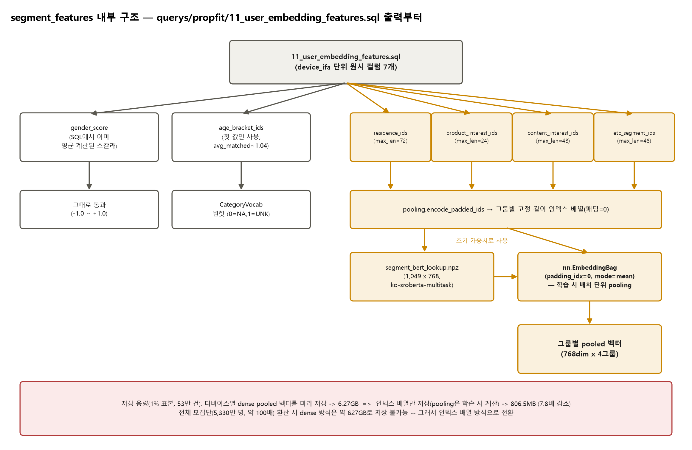

# 모델 아키텍처 스펙 (seed 트랙)

`embedding/`(모델 정의) 기준 요약. 필드/하이퍼파라미터를 바꾸면 이 문서도 같이 갱신한다.
실행 방법은 [`README.md`](../README.md) 참고, 이 문서는 "무엇을 어떻게 인코딩하는가"만 다룬다.

입력은 propfit `skp` 세그먼트와 media(방문 앱/사이트 시퀀스) 두 가지다 — profile(01) 원본
CSV는 이미 추출되지만(`seed/queries/04a/05a/07a`), 아직 이걸 학습해서 임베딩으로 만드는
모델(옛 addi 트랙의 `user_profile`에 해당하는 것)은 propfit 스키마에 맞춰 새로 만들어야
한다 — "다음 단계" 참고.

## `segment_features` — propfit skp 세그먼트 피처 (`embedding/segment_features/`)

입력: [`seed/queries/lib/11_user_embedding_features.sql`](../queries/lib/11_user_embedding_features.sql)
(device_ifa 단위, skp `segments` 컬럼을 성별/연령대/거주/제품 관심사/콘텐츠 관심사/기타
6개 그룹으로 나눠 뽑음 — 그룹 정의·커버리지 실측 근거는 `eda/docs/`의 세그먼트 분포
분석 참고). Autoencoder 구조로 레이블 없이 "자기 자신을 복원"하며 인코더 출력을 임베딩으로
쓰고 디코더는 학습에만 쓰고 버린다(유저 1명당 스냅샷 필드들이라 시퀀스 기반 구조가 안 맞음).



필드별 인코딩 방식이 서로 다르다(2026-07-24 확정):

| 필드 | 방식 | 비고 |
|---|---|---|
| `gender_score` | 스칼라(-1.0~+1.0), SQL에서 이미 계산 | 여성(High)=+1.0/여성(Low)=+0.5/남성(High)=-1.0/남성(Low)=-0.5, 매칭 여러 개면 평균(예: High+Low 동시면 ±0.75). High/Low가 "확신도"라는 의미를 원핫이 아닌 스칼라로 보존 |
| `age_bracket_idx` | `CategoryVocab` 원핫(0=`<NA>`, 1=`<UNK>`=모름, 2~=실제 값) | `avg_matched≈1.04`라 거의 항상 단일값, 드물게 여러 개면 첫 값만 사용 |
| `residence_idx` | segment_id 인덱스 배열(`max_len=72`), 학습 시 EmbeddingBag pooling | 거주지(도)/서울거주지(구)/목적지(도·구·업종) 5개 depth2를 쪼개지 않고 하나의 bag으로(2026-07-24 결정) |
| `product_interest_idx` / `content_interest_idx` / `etc_segment_idx` | 각각 segment_id 인덱스 배열(`max_len=24/48/48`), 학습 시 EmbeddingBag pooling | 같은 BERT lookup을 공유하되 그룹별로 분리 풀링 — 인구 겹침(기타가 제품·콘텐츠를 98%+ 포함)이 정보 겹침을 뜻하진 않아 하나로 합치지 않음 |

거주·관심아 4그룹은 `segment_bert_lookup.npz`(세그먼트_카테고리.csv의 depth1/2/3+이름 경로
텍스트를 `jhgan/ko-sroberta-multitask`로 인코딩, 1,049 x 768)를 공유 lookup으로 쓴다. index
0은 padding 전용(전부 0벡터) — 실제 mean pooling은 이 lookup을 초기 가중치로 쓰는
EmbeddingBag이 학습 시 배치 단위로 계산하고, `build_features.py`는 인덱스 배열까지만
만들어서 저장한다.

**저장 방식을 이렇게 정한 이유(디바이스별 dense 벡터 사전 계산은 규모가 안 됨)**: 처음엔
그룹별로 미리 mean pooling한 768dim 벡터를 디바이스마다 저장하려 했는데, 1% 표본(53만
건)만으로 6.27GB가 나왔다 — 전체 모집단(5,330만 명, ~100배)으로 확장하면 약 627GB로 저장이
불가능하다. 인덱스 배열만 저장하는 방식으로 바꾸니 같은 표본이 806.5MB(7.8배 감소, 전체
환산 시 약 78GB)로 줄었다.

| 하이퍼파라미터 | 값 |
|---|---|
| BERT 모델 | `jhgan/ko-sroberta-multitask` (768dim, 사전학습 한국어 SBERT) |
| lookup 크기 | 1,049개 segment_id(+padding 1행) |
| `max_len`(residence / product / content / etc) | 72 / 24 / 48 / 48 (1% 표본 p99 기준, 초과분은 뒤에서부터 자름) |

### 임베딩 모델 (`embedding/segment_features/model.py`, `train/segment_features.py`)

```
gender_score(스칼라) ─────────────────────────────┐
age_bracket_idx → nn.Embedding(vocab, 8) ─────────┤
residence/product/content/etc_idx                 ├─ concat(89dim) → Linear(89→64)→ReLU
  → 공유 nn.EmbeddingBag(768dim, BERT lookup 초기화) ┤   →Linear(64→32) = z(임베딩)
  → 그룹별 Linear 투영(residence→32, 나머지→16) ────┘
```


- 768dim은 나머지 필드(1~8dim)에 비해 압도적으로 커서, 그대로 concat하면 사실상 거주/관심아
  4개 벡터가 임베딩 전체를 지배한다 — 그래서 그룹별로 작은 `Linear` 투영(residence→32,
  product/content/etc→16)을 거친 뒤에 concat한다. 투영 차원은 "그룹이 담는 정보량"(카디널리티/
  max_len)에 대략 비례하게 잡았다(거주가 가장 커서 32로 더 크게).
- concat(89dim) → `Linear(89→64)→ReLU→Linear(64→32)` = z(임베딩). z 차원(32)은 원본 신호
  자체가 6개 필드로 상대적으로 단순해 64dim까지 안 써도 된다고 봤지만, 확정 값은 아니고
  실험 후 조정 대상.
- 디코더는 필드별 복원 헤드로 갈라진다: `gender_score`는 MSE, `age_bracket_idx`는
  cross-entropy, 거주/관심아 4그룹은 (원본 768dim이 아니라) **인코더가 만든 투영 벡터를
  재구성**하는 MSE로 뒀다 — 768dim 자체를 복원 타깃으로 쓰면 손실이 그 큰 차원에 지배돼
  다른 필드 신호가 묻힐 수 있어서다(학습 스크립트가 이 타깃에 `.detach()`를 적용해 두
  branch가 서로를 향해 붕괴하는 것도 막는다). 대안으로 그룹별 원래 vocab에 대한
  multi-hot(있음/없음) 예측(BCE)도 검토할 만하다(AutoRec류 implicit-feedback 오토인코더
  방식) — 어느 쪽이 나은지는 실험 필요.

**학습 실행**: `python -m embedding.segment_features.build_features`로 `segment_features.npz`/
`segment_bert_lookup.npz`/`age_bracket_vocab.json`을 먼저 만든 뒤,
`python -m train.segment_features`로 학습한다(`seed/`에서 실행, `seed/README.md` 참고).

## `media_sequence` — propfit 방문 앱/사이트 시퀀스 (`embedding/media_sequence/`, 2026-07-31)

입력: [`seed/queries/04b/05b/07b_*_media.sql`](../queries/) (device_ifa 단위, top500
media(`03_create_media_vocab_table.sql`) 방문 이벤트 시퀀스, 30분 재방문 dedup 이미 적용됨).
옛 addi 트랙 `embedding/media_sequence/`(SASRec)를 propfit 스키마로 이식한 것 — addi는
`content_genre`(다중 장르)가 있었지만 propfit `02_user_media.sql`은 그게 비어 있는 대신
`inventory_type`(app/site, 이벤트당 값 하나)을 준다는 차이만 있고 나머지 구조는 동일하다.

```
media(아이템) → nn.Embedding(vocab≤500, 64) ─────────────┐
position                → nn.Embedding(max_len=50, 64) ──┤
inventory_type/ad_type/  → 각각 nn.Embedding(64) ─────────┼─ sum → causal
  connection_type                                         │  TransformerEncoder(2층, 2head)
                                                            └─ → 마지막 실제 스텝의 hidden = z(64dim)
```

다음-아이템(next-item) 예측으로 라벨 없이 학습한다(SASRec 원 설계 그대로). 이벤트가
5개(`MIN_SEQ_LEN`) 미만인 디바이스는 학습/추론 모두에서 제외 — 신호가 너무 약해 신뢰하기
어렵다는 뜻이라, segment(전체 인구 커버) 대비 media 임베딩은 애초에 커버리지가 좁다.

**전처리가 두 단계로 나뉘는 이유**: `04b/05b/07b_*_media.csv`는 이벤트 그레인이라 합치면
최대 14GB — segment처럼 pandas로 한 번에 못 읽는다. `embedding/media_sequence/build_features.py`가
CSV를 청크 단위 스트리밍으로 2-pass(① vocab 적합 ② 디바이스별 시퀀스 인코딩) 처리해
`media_features.npz`로 압축한 뒤, `train/media_sequence.py`/`inference/media_sequence.py`는
이 무거운 전처리를 다시 하지 않고 npz만 읽는다.

**학습 실행**: `python -m embedding.media_sequence.build_features`로 `media_features.npz`
+ vocab 4종을 먼저 만든 뒤, `python -m train.media_sequence`로 학습한다. segment_features
학습이 겪었던 "마지막 epoch이 중간 epoch보다 나빠져도 되돌릴 방법이 없는" 문제(아래 참고)를
피하려고 epoch마다 `model.pt`(마지막)와 `model_best.pt`(최저 loss)를 같이 저장한다.

## 스코어링 파이프라인 (2026-07-30 segment MVP → 2026-07-31 segment/media 확장)

`scoring/config.py`의 `VARIANTS`로 입력 임베딩 소스를 고른다. `segment`/`media` 각각
자신의 임베딩 CSV 하나만 쓰고, 둘 다 같은 `LookalikeClassifier`/학습 루프를 공유한다.

```
1) inference/segment_features.py, inference/media_sequence.py
   각 encoder로 전체 디바이스(seed+pool+candidate 구분 없이 합쳐짐)를 인코딩
   → segment_embeddings.csv(z_0..z_31) / media_embeddings.csv(m_0..m_63)

2) scoring/train_lookalike.py --variant {segment,media}
   위 임베딩을 04c_seed_segment.csv(seed, label=1)/05c_pool_segment.csv(pool, label=0)의
   device_ifa로 필터링 → LookalikeClassifier를 BCEWithLogitsLoss로 학습 →
   data/models/lookalike_classifier{_media}/model.pt

3) scoring/infer_lookalike.py --variant {segment,media}
   같은 방식으로 candidate(2026-06) 필터링 → lookalike_score 계산 →
   candidate_scores.csv(전체) + candidate_scores_top{N}pct.csv(상위 N%) 저장.
   `--candidate-ids-csv`/`--embeddings-csv`로 기본 candidate 집단(07c) 대신 다른 candidate
   집단(예: media 활동 기준으로 새로 뽑은 candidates_202606_media_sample)에 재학습 없이
   그대로 스코어링할 수 있다.
```

media 단독 분류기의 val AUC는 0.67 수준으로, segment 단독(0.86 수준)보다 뚜렷이 약하다 —
방문 앱/사이트 이력만으로는 seed와 pool을 구분하는 힘이 세그먼트 정보보다 한참 못 미친다는
뜻이다. media 임베딩 자체도 이벤트 5개 미만 디바이스가 빠지는 만큼 candidate 커버리지가
segment보다 좁다.

## 다음 단계 / 아직 없는 것

- **profile 임베딩 모델이 없음**: `seed/queries/04a/05a/07a`로 원본 CSV는 이미 뽑히지만,
  이걸 학습해서 임베딩으로 만드는 모델(옛 addi 트랙의 `embedding/user_profile`에 해당)이
  propfit 스키마용으로는 아직 없다. 생기면 `scoring/config.py`의 `VARIANTS`에 소스 하나
  추가하는 정도로 그대로 확장할 수 있다.
- **후보 리스트의 실제 검증 라벨이 없음**: candidate는 아직 전환 여부를 모르는 진짜 신규
  유저라(정의상 그럼) `val_auc`(seed vs pool 구분 성능)로만 모델을 검증했다 — 이게 실제
  candidate lookalike 순위를 얼마나 잘 매기는지는 추후 캠페인 집행 후 `ab_postback_log`로
  확인해야 한다(README.md의 "신규" 정의 참고).
